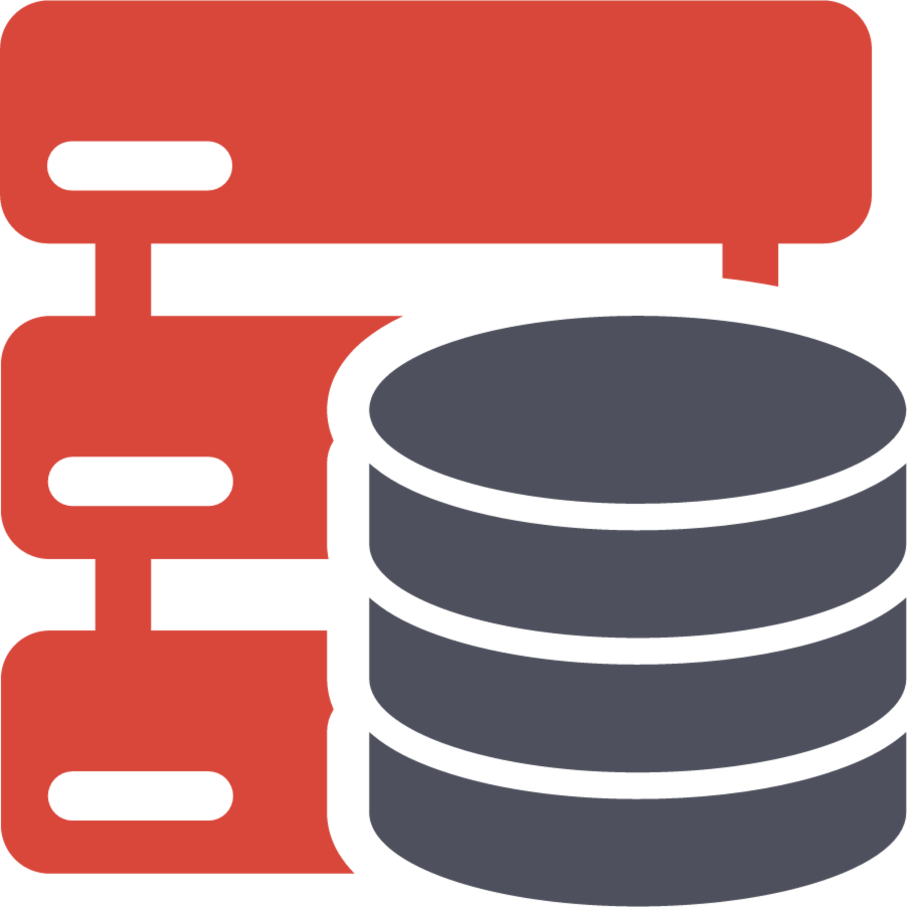
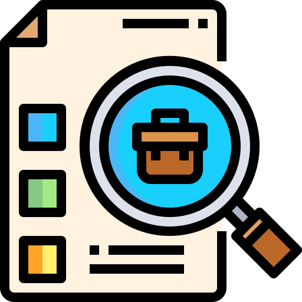
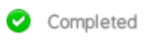

<!--### Hi there 👋-->

  

  

  <b> to my personal GitHub profile! </b>

  

  

    🦴🦴🦴🦴🦴🦴🦴🦴🦴🦴🦴🦴🦴🦴🦴🦴🦴🦴🦴🦴🦴🦴🦴🦴🦴🦴🦴🦴🦴🦴🦴  
  <b> 🦴 I am a software developer with a huge passion for continuous learning and STEM topics.🦴</b>  
  <b> 🦴‎ ‎ My current interests include data science and applying machine learning algorithms to‎ ‎ ‎🦴</b>  
  <b>‎ 🦴‎ ‎ ‎ ‎ solve complex problems using real-world data. On my free time I like developing my‎ ‎ ‎ ‎‎🦴 </b>   
  <b> 🦴‎ ‎ ‎ ‎ ‎ ‎ problem-solving skills, building unique projects, and watching people test them.‎ ‎ ‎ ‎ ‎ ‎ ‎ ‎ ‎🦴</b>
    🦴🦴🦴🦴🦴🦴🦴🦴🦴🦴🦴🦴🦴🦴🦴🦴🦴🦴🦴🦴🦴🦴🦴🦴🦴🦴🦴🦴🦴🦴🦴  

 
    <b> My Socials (WOOOO!): </b>  

<h4 align="center">
  <code><a href="https://www.linkedin.com/in/ernie-sumoso" title="LinkedIn"> LinkedIn </a></code> 
  <code><a href="https://www.instagram.com/ernieluds1403/" title="Instagram"> Instagram </a></code>
  <code><a href="https://www.credly.com/users/ernie.ai" title="Credly"> Credly </a></code>
  <code><a href="https://leetcode.com/u/ErnieSumoso/" title="LeetCode"> LeetCode </a></code>
  <code><a href="https://www.hackerrank.com/profile/ErnieSumoso" title="HackerRank"> HackerRank </a></code>
</h4>

 
    <b> What I've worked with (so far): </b>  

<h5 align="center">
   <code> <b> ‎‎‎Python </b> </code>  | 
   <code> <b> ‎ SQL‎  </b> </code>  | 
   <code> <b> ‎ Git‎  </b> </code>  | 
   <code> <b> ‎ AWS‎  </b> </code>  | 
   <code> <b> Azure ‎‎</b> </code>  
   <code> <b> ‎‎ Java </b> </code>  | 
   <code> <b> MongoDB </b> </code>  | 
   <code> <b> C# </b> </code>  | 
   <code> <b> JavaScript </b> </code> | 
   <code> <b> Unity  ‎‎</b> </code>
</h5>

 
    <b> Most recent projects and contributions (🛠️): </b>    

| Icon | Project | Description | Status |
|---|---|---|---|
|  | <a href="https://github.com/NILodio/JobsPyMacher"> JobsPyMatcher </a>‎ ‎| An application that helps students increase their chances of getting noticed by recruiters by significantly improving their resumes for targeted job descriptions.|  |
|  | <a href="https://github.com/NILodio/dota2Analytics"> Dota2Analytics </a> | An application that predicts the winning team in Dota 2 e-sports matches before they start. This classification problem involves various independent features and a large amount of data to analyze.|  |
|  | <a href="https://github.com/NILodio/toxic-audio-detection"> Toxic Audio Detection </a> | Web application to detect and identify sections of inappropriate usage of words and/or yelling within audio files.|  |

 
    <b>🦴 See you around! 💌 :) 🦴</b>     

  

<!--
 
  Here's 1 more in case you didn't have enough: 🦴

-->

