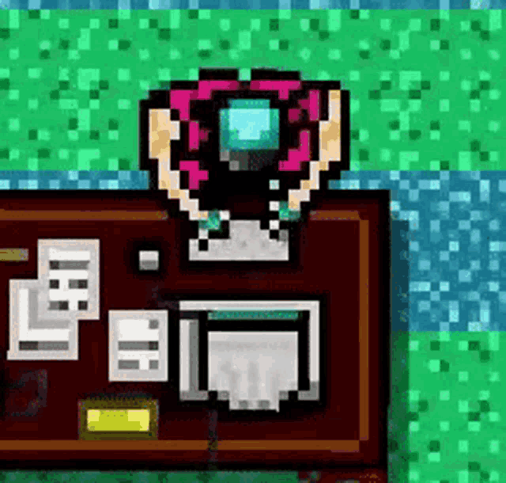

<!--

  

  

 -->

  <b> Welcome to my GitHub profile!</b>

  

  

    🦴🦴🦴🦴🦴🦴🦴🦴🦴🦴🦴🦴🦴🦴🦴🦴🦴🦴🦴🦴🦴🦴🦴🦴🦴🦴🦴🦴🦴🦴🦴    
  I am a software developer with experience delivering solutions across banking, tax, and government sectors.
  I have worked on automated testing for software QA using Java 17, front-end development with Angular 18, and 3D shape reconstruction using machine learning and CNNs in Python 3. I’ve also collaborated with engineers to deliver a variety of high-impact projects.
  Recently, I completed a postgraduate degree in AI and Machine Learning. Currently building a videogame in Unity using C# 8.0.
      🦴🦴🦴🦴🦴🦴🦴🦴🦴🦴🦴🦴🦴🦴🦴🦴🦴🦴🦴🦴🦴🦴🦴🦴🦴🦴🦴🦴🦴🦴🦴  

 
    <b> My Socials: </b>  

<h4 align="center">
   
   
   
   
</h4>

 
    <b> What I've worked with so far: </b>  

  
  
  
  
  
  
  
  
  
  
  

 
    <b> Most recent projects and contributions (🛠️): </b>    

| Icon | Name | Description | Status |
|---|---|---|---|
|  | <a href="https://flakes1403.itch.io/someone-is-following-me"> Someone Is Following Me </a> | Horror videogame built in Unity, all game mechanics were programmed from scratch using C#. (Code will be uploaded soon) |  |
|  | <a href=https://github.com/ErnieSumoso/impostor-syndrome-comparison-map> Impostor Syndrome Comparison Map </a>†â€| Web application that measures an Impostor Syndrome metric, plots 2D & 3D visualizations and experiments with clustering algorithms.|  |
|  | <a href="https://github.com/ErnieSumoso/JobsPyMacher"> JobsPyMatcher </a>†â€| Web application to improve resumes for a targeted job description. It involves various NLP techniques and an ML classification model to detect job industries. |  |
|  | <a href="https://github.com/ErnieSumoso/dota2Analytics"> Dota2Analytics </a> | Web application that predicts the winning team of a Dota 2 e-sports match. This involves an ML classification model, front and back-end development.|  |
|  | <a href="https://github.com/NILodio/toxic-audio-detection"> Toxic Audio Detection </a> | Web application to detect and identify sections of inappropriate language and yelling within audio files. Trained a CNN for audio detection.|  |

 
    <b>🦴 See you around! 🦴</b>     

  

